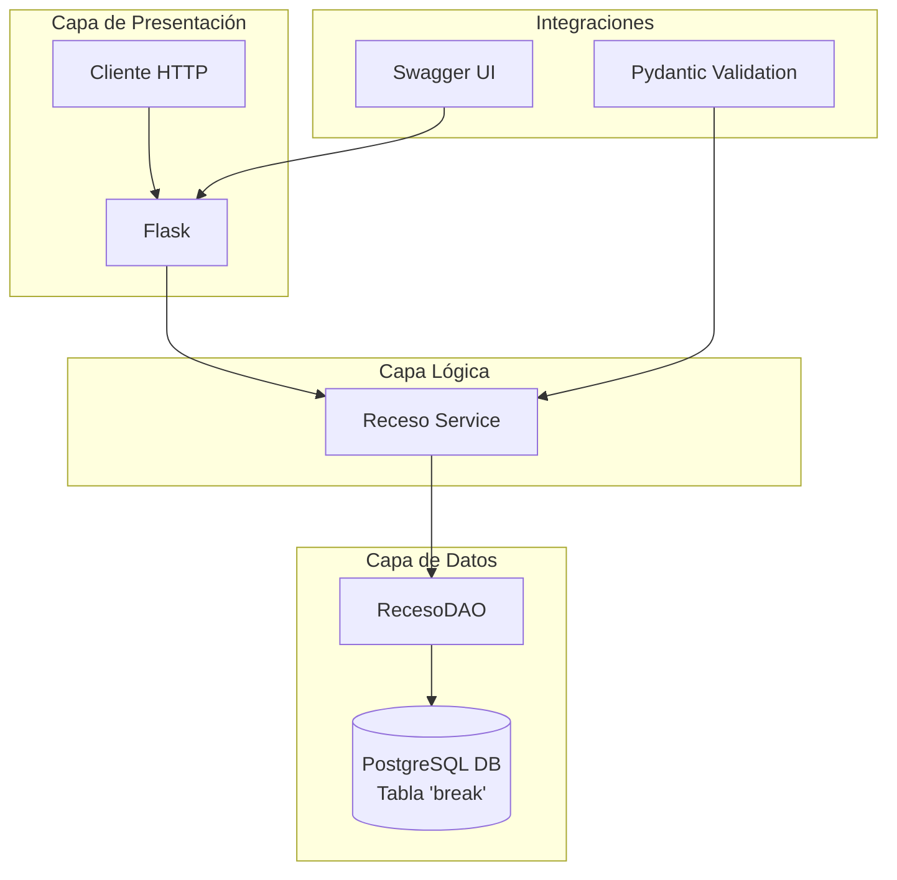
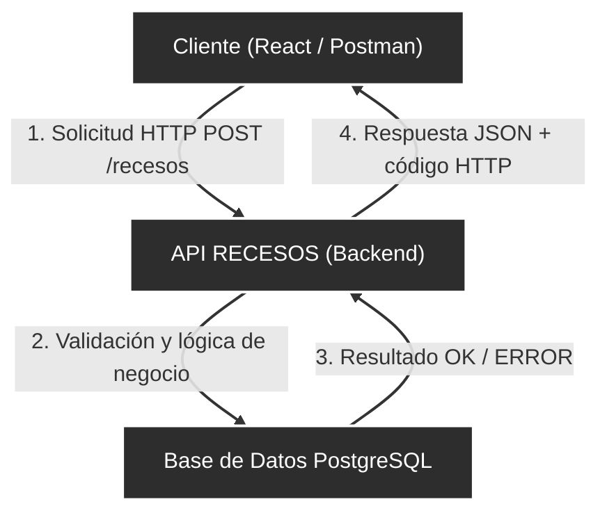

# API Recesos – Flask

API REST desarrollada con Flask para la gestión de recesos. Permite listar, buscar, crear y actualizar recesos. Incluye documentación interactiva con Swagger (Flasgger).

## Tecnologías
- Python 3
- Flask
- Flask-CORS
- PostgreSQL
- psycopg2-binary
- Pydantic
- Swagger (Flasgger)

## Estructura del proyecto
```ini
recesos_api/
│── app.py
│── config.py
│── requerimientos.txt
│── test_db.py
│── .env
│
├── routes/
│ └── recesos.py
│
├── services/
│ └── receso_service.py
│
├── daos/
│ └── receso_dao.py
│
├── schemas/
│ └── receso_schema.py
```

## Arquitectura del Sistema
El proyecto sigue una arquitectura en capas para separar responsabilidades:


    
## Entorno de Python

Crear un entorno virtual:
```bash
python -m venv .venv
```
Activar el entorno:

Windows (PowerShell):
```powershell
.venv\Scripts\activate
```

Linux / Mac:
```bash
source .venv/bin/activate
```

Instalar dependencias:
```bash
pip install -r requerimientos.txt
```

Variables de entorno (.env)
Crear un archivo .env en la raíz del proyecto con la configuración de PostgreSQL:
```ini
DB_HOST=localhost
DB_NAME=nombre_base
DB_USER=usuario
DB_PASSWORD=password
DB_PORT=5432
```

## Ejecución
Iniciar la API:
```bash
python app.py
```
Base URL:
```bash
http://127.0.0.1:5000
```
## Endpoints
Health check:
```http
GET /health
```

Recesos:
```http
GET /recesos

GET /recesos?nombre=ALMUERZO

POST /recesos

PUT /recesos/{id}
```

Ejemplo de body para POST/PUT:
```json
{
  "id_t": 1,
  "hora_inicio": "08:00:00",
  "hora_fin": "09:00:00",
  "total": "01:00:00",
  "nombre": "ALMUERZO",
  "descripcion": "Receso principal",
  "tipo": "NORMAL"
}
```
## Swagger
Documentación interactiva:
```text
http://127.0.0.1:5000/apidocs/
```

## Flujo de Ejecución

El siguiente diagrama muestra el flujo de interacción típico al crear o consultar un receso:



